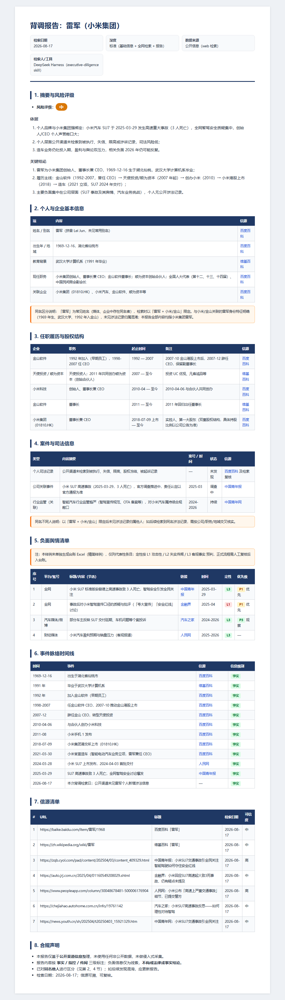
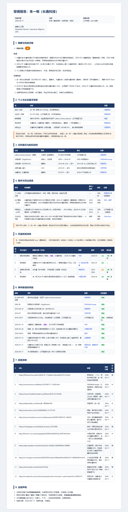

# 示例（脱敏）

本目录存放**脱敏**的示例输出（如 `sogou_sample.json`），仅用于展示工具输出格式，不含真实个人可识别信息。

## 报告样例（基于公开信息）

`reports/` 目录存放**基于公开信息的样例背调报告**（目标为公开知名企业家），用于演示报告格式与工作流产物，不构成对任何人的评价或结论：

| 样例 | 报告（Markdown） | 预览 |
| --- | --- | --- |
| 雷军 · 小米集团（风险评级：中） | [雷军_小米_背调报告_2026-08-17.md](reports/雷军_小米_背调报告_2026-08-17.md) | [](reports/雷军_小米_背调报告_2026-08-17.md) |
| 朱一明 · 长鑫科技（风险评级：中） | [朱一明_长鑫科技_背调报告_2026-08-17.md](reports/朱一明_长鑫科技_背调报告_2026-08-17.md) | [](reports/朱一明_长鑫科技_背调报告_2026-08-17.md) |

> 样例按 [skill/templates/report.md](../skill/templates/report.md) 模板生成，含事实 / 指控 / 传闻三级标注、同名区分、信源清单与合规声明；内容仅限公开渠道信息，边界见 [docs/compliance.md](../docs/compliance.md)。

## sogou_sample.json

`scripts/sogou_search.py` 的输出示例（已脱敏、截断）：

```json
{
  "keyword": "示例关键词",
  "type": "2",
  "pages_requested": 1,
  "captcha": false,
  "total": 3,
  "items": [
    {
      "title": "示例文章标题一",
      "account": "示例公众号",
      "date": "2026-08-01",
      "summary": "示例摘要……",
      "href": "https://weixin.sogou.com/link?url=..."
    }
  ],
  "note": "仅索引微信公众号内容，不含视频号；href 为搜狗加密跳转链接",
  "generated_at": "2026-08-17T00:00:00"
}
```

## 真实输出参考

- 搜狗检索：`python skill/scripts/sogou_search.py --keyword "关键词" --pages 2 --output result.json`
- 小红书搜索（浏览器注入 Cookie）：见 `docs/platform-matrix.md`「小红书网页搜索」行
- 负面台账：`python skill/scripts/build_ledger.py entries.json 台账.xlsx`
